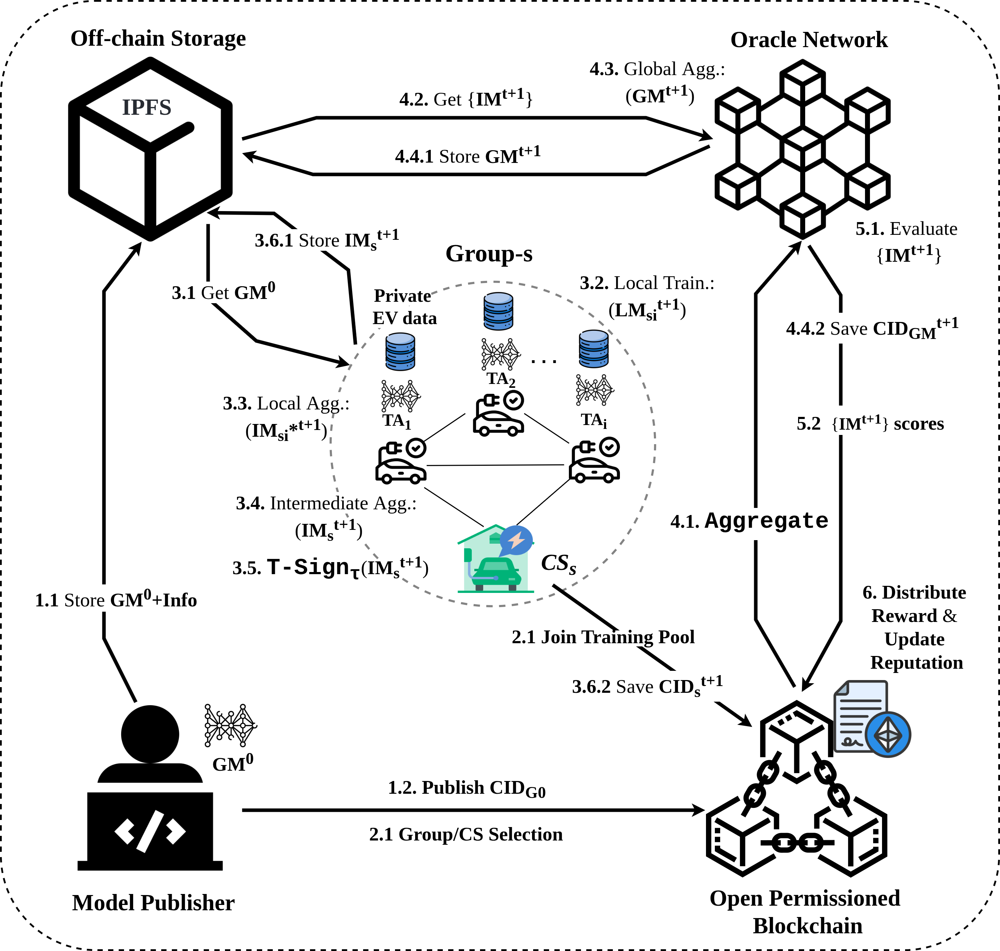

# ABC-DFL

Welcome to the **ABC-DFL** project — a clustered, decentralized, and resilient framework for federated learning in connected EVs. This repository includes:

- ✅ Implementation of the **FLECA** filtering and aggregation protocol  
- ✅ Smart contracts for trust and coordination  
- ✅ Benchmark tests for performance evaluation


---

## What is ABC-DFL?

**ABC-DFL** (A Byzantine-Robust Clustered Decentralized Federated Learning Framework for Secure and Efficient EV Battery Data Management) is a framework designed to securely and efficiently manage federated learning tasks across clustered and dynamic networks of Electric Vehicles (EVs) and Charging Stations (CSs). It tackles **model poisoning attacks** using a robust layred decentralized aggregation mechanism called FLECA.

<p align="center">
  
</p>

---

## About FLECA

At the core of ABC-DFL lies **FLECA**:  
> **F**iltered  
> **L**ayered  
> **E**nhanced  
> **C**lustering  
> **A**ggregation  

FLECA uses a **two-stage filtering process**:
- **Stage 1:** Performed locally at each **Electric Vehicle (EV)**
- **Stage 2:** Executed by decentralized **Oracles**

Importantly, FLECA operates **without relying on a central aggregator**, ensuring trustless decentralization, and resilience in dynamic EVs environments.

---

## Getting Started

You can run the following commands to explore and test ABC-DFL smart contracts:

```bash

# Run smart contract tests
npx hardhat test

# Run tests with gas usage reporting
REPORT_GAS=true npx hardhat test

# Start a local Hardhat blockchain node
npx hardhat node

# Deploy smart contracts using Hardhat
npx hardhat run scripts/deploy_1.js

```

## Running C-DFL Benchmarks

All C-DFL benchmark experiments can be reproduced using the scripts in the src/ folder.

```
⚠️ Note: A README.md is included inside the src/ directory with detailed instructions to run all benchmarks, configure attacks, and evaluate defenses.
```

We are currently working on a full integration framework for ABC-DFL. In the meantime, if you are interested in hybrid on-chain/off-chain decentralized federated learning (DFL) systems, check out our previous work on [AutoDFL](https://github.com/meryemmalakdif/AutoDFL), which provides Oracles and L2 integration for scalable and secure deployments.
